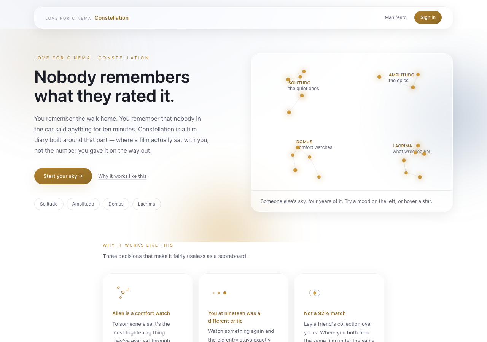
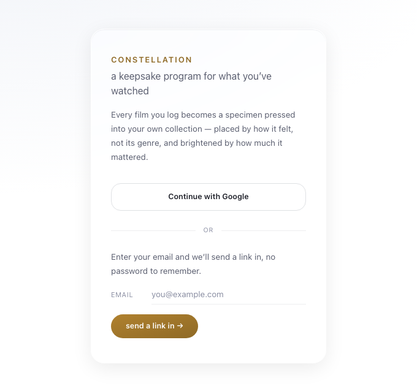
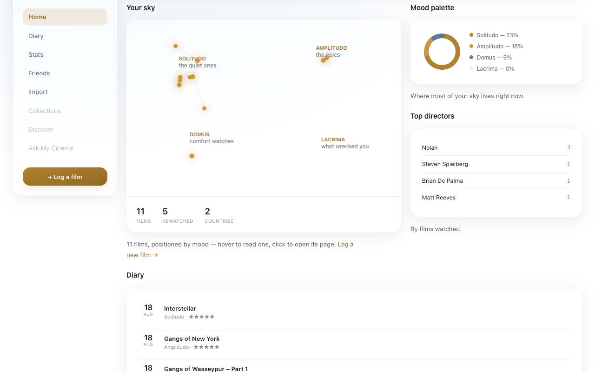
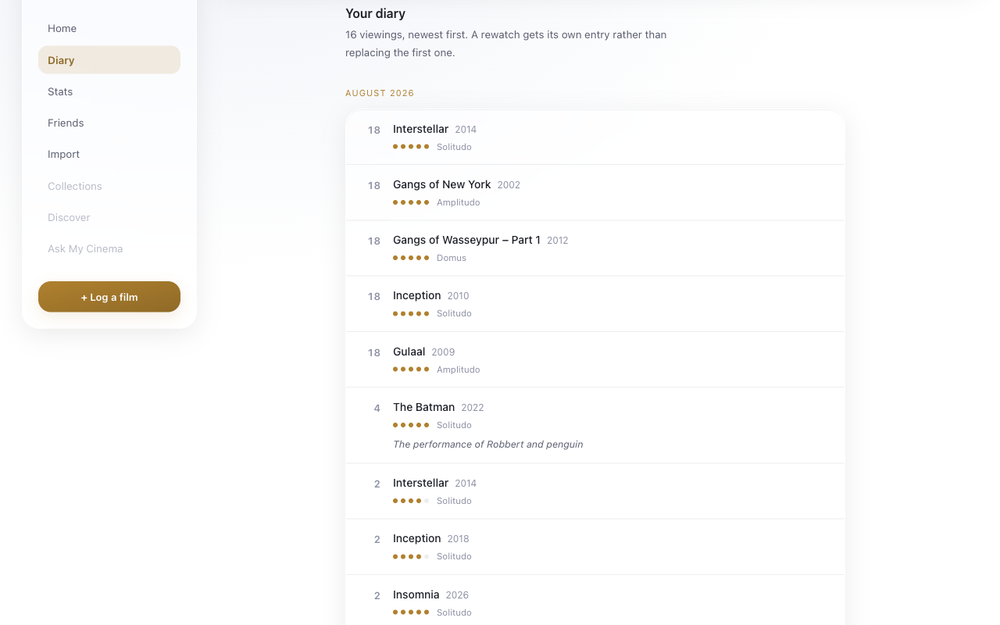
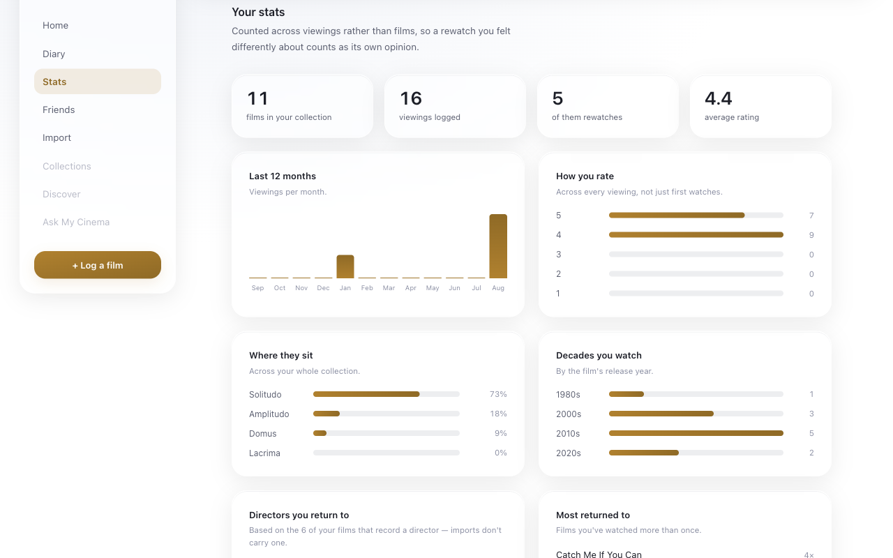
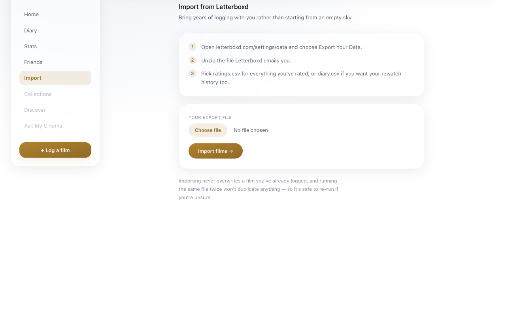
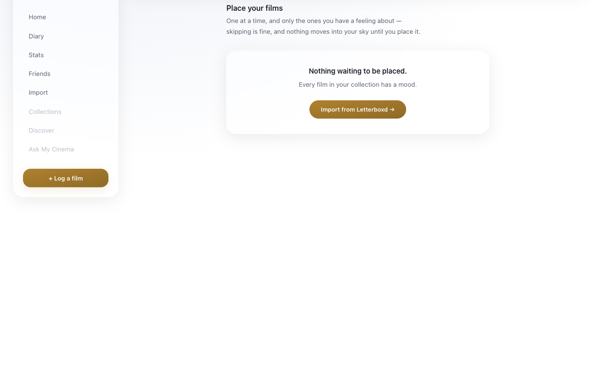
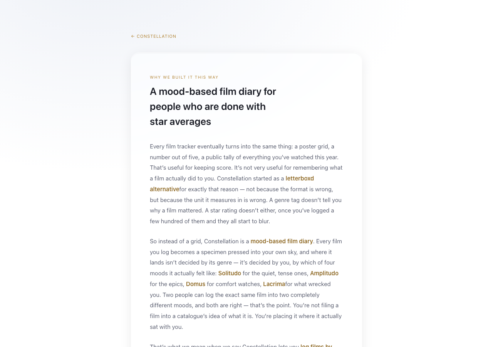

# Love for Cinema

A mood-based film diary, built for [Love for Cinema](https://loveforcinema.com). No star-out-of-five average, no poster grid — every film you log is placed in one of four moods (*Solitudo*, *Amplitudo*, *Domus*, *Lacrima*), and where it lands is a choice, not a category a catalogue assigned it. A rewatch adds to that film's record instead of overwriting your first verdict, and comparing taste with a friend means overlaying two skies to see where you actually agree — not a percentage an algorithm invented.



## Stack

- **Next.js 16** (App Router, Turbopack) — this version has real breaking changes from what you may know; read `node_modules/next/dist/docs/` before assuming an API
- **React 19**, TypeScript, Tailwind CSS v4
- **Supabase** — Postgres, Auth, Row Level Security
- **Cloudflare Workers**, deployed via OpenNext
- **TMDB** for film search and metadata
- **Resend** for email

## Getting started

```bash
npm install
```

Create `.env.local`:

```bash
NEXT_PUBLIC_SUPABASE_URL=
NEXT_PUBLIC_SUPABASE_PUBLISHABLE_KEY=
TMDB_API_KEY=
RESEND_API_KEY=
```

Run the schema in `supabase/schema.sql` against your Supabase project — it's idempotent and safe to re-run as it's grown incrementally. Then:

```bash
npm run dev
```

## Scripts

| Command | Does |
|---|---|
| `npm run dev` | Local dev server |
| `npm run build` | Production build |
| `npm run lint` | ESLint |
| `npm run preview` | Build and preview the Cloudflare Worker locally |
| `npm run deploy` | Build and deploy to Cloudflare |
| `npm run cf-typegen` | Regenerate `cloudflare-env.d.ts` from `wrangler.jsonc` |

## What's here

### Sign in (`/login`)

Google, or a magic link — no password to remember.



### Logging and the sky (`/collection`)

Search TMDB, place a film in one of four moods, rate it — it becomes a star in your sky, positioned by feeling rather than genre. The dashboard also shows a mood breakdown, top directors, and a diary preview.



### Diary (`/diary`)

Every viewing as its own dated entry, newest first. A rewatch gets its own line rather than replacing the original, so a film you've watched three times shows up three times — each with the rating and mood you gave it that time.



### Stats (`/stats`)

Counted across viewings rather than films, so a rewatch you felt differently about registers as its own opinion. Rating distribution, activity over the last 12 months, mood split, decades, directors, most-rewatched.



### Friends (`/friends`)

Mutual-consent requests — not a one-way follow. Once accepted, a Taste Twins overlay lays two collections on top of each other, and a film you both placed in the exact same spot lights up. That coincidence is the point, not a percentage a matching algorithm invented.

### Import from Letterboxd (`/import`)

Bring in `ratings.csv`, `diary.csv`, or `watched.csv` — whichever of those columns are present gets read, and repeat diary entries for the same film collapse into its rewatch history.



### Placing your import (`/place`)

An export knows what you watched and how you rated it, not how it felt, so imported films arrive unplaced and wait here until you give each one a mood — one at a time, skip freely. Nothing joins your sky until it's placed.



### Manifesto (`/manifesto`)

The reasoning behind the mood-based approach, for anyone who lands on the site cold.



## Project structure

```
src/
  app/            routes (App Router) — one folder per page, actions.ts for server actions
  components/     UI, grouped by the page or feature that owns it
  lib/            data access (films.ts, friends.ts), parsing (letterboxd.ts), and pure logic
                  (diary.ts, stats.ts, starfield.ts)
  data/           static content — the four mood clusters, sample films for the landing page
supabase/
  schema.sql      the whole schema, additive migrations included inline with their reasoning
```

## Design notes worth knowing before changing things

- **Friends are mutual-consent on purpose.** A one-way follow was considered and rejected — seeing someone's full collection is intimate enough that both sides should have agreed to it.
- **A rewatch never overwrites.** `createFilm` uses `.insert()`, not `.upsert()`; a unique-violation means the film already exists, and the caller routes to `addRewatch` instead.
- **Imported films start with `cluster = null`** and are deliberately excluded from the sky and from stats until placed — see the migration comment in `schema.sql` for why guessing a mood was rejected.
- **Storage is capped on import**, since a bulk import is the one action a single account could take that meaningfully costs the database: 10,000 films per user, 5,000 rows per import, deterministic film IDs (`slug-year`) so re-importing the same file is a no-op rather than a duplicate.
- Real dark mode support — `prefers-color-scheme` drives CSS custom properties, and canvas-drawn elements (the sky, the overlap view) resolve their colors from those properties at paint time rather than hardcoding them.
